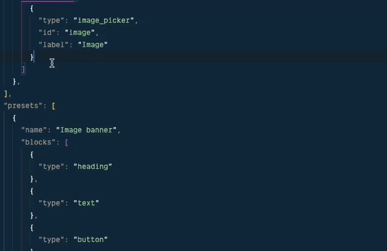

# Shopify Section Schema Snippets

VSCode / Cursor snippets for Shopify Section schema input types.

[Shopify Docs](https://shopify.dev/docs/storefronts/themes/architecture/settings/input-settings)

## Installation

1. Copy contents of `liquid.json` into your clipboard.
2. In VSCode or Cursor, open the command palette (cmd + shift + p) and type 'Snippets' then select 'Configure Snippets'
3. Select the 'liquid.json' file in the list.
4. Paste the contents of your clipboard into the file.
5. Save the file.

You should now be able to use these inside `.liquid` files.

EG. type `sstext` and hit `TAB`, it will expand to:

```liquid
{
  "type": "text",
  "id": "text_input",
  "label": "Text input",
  "default": "A basic text input's content"
}
```

## Demo



All snippets are prefixed with `ss` (section settings)and then the type of input.

### Full list of snippets:

| Input setting | shortcode     |
| ------------- | ------------- |
| checkbox      | sscheckbox    |
| number        | ssnumber      |
| radio         | ssradio       |
| range         | ssrange       |
| select        | ssselect      |
| text          | sstext        |
| textarea      | sstextarea    |
| article       | ssarticle     |
| blog          | ssblog        |
| collection    | sscollection  |
| color         | sscolor       |
| font_picker   | ssfont        |
| html          | sshtml        |
| image_picker  | ssimagepicker |
| link_list     | sslinklist    |
| page          | sspage        |
| product       | ssproduct     |
| richtext      | ssrichtext    |
| url           | ssurl         |
| video_url     | ssvideourl    |
